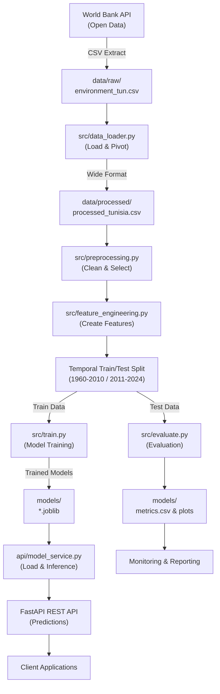
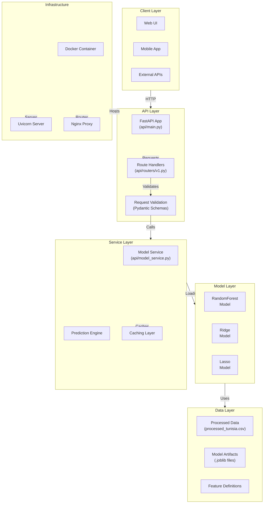
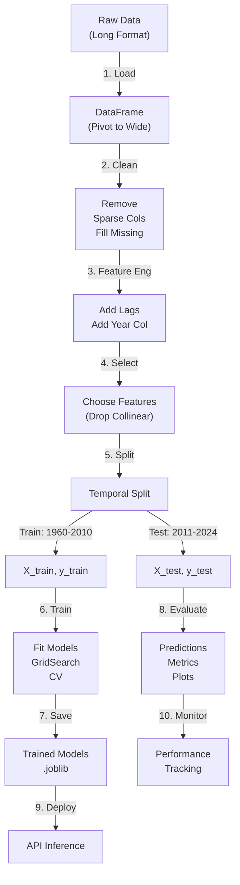
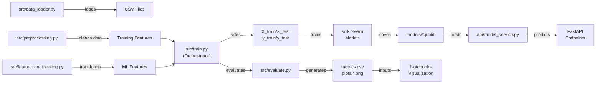
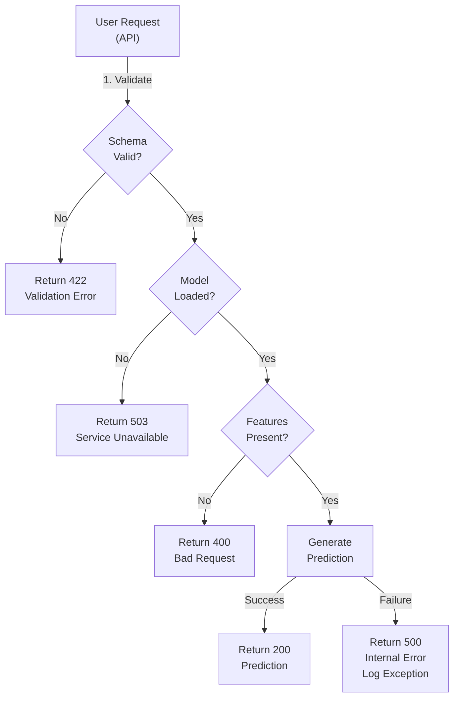

# System Architecture

## Overview

Tunisia Water Stress ML follows a modular, layered architecture supporting data ingestion, ML processing, API serving, and monitoring.

---

## Architecture Diagrams

### Data Flow Pipeline



### System Architecture



### ML Pipeline Detail



### Component Interaction



### Error Handling & Validation



---

## Component Responsibilities

### Data Pipeline (`src/`)

| Component | Responsibility | I/O |
|-----------|-----------------|-----|
| `data_loader.py` | Load WB data, pivot to wide format | CSV → DataFrame |
| `preprocessing.py` | Clean, fill, select features | DataFrame → DataFrame |
| `feature_engineering.py` | Create lags, temporal features | DataFrame → DataFrame |
| `train.py` | Orchestrate pipeline, train models | CSV → .joblib |
| `evaluate.py` | Compute metrics, generate plots | DataFrame → metrics.csv, PNG |

### API Layer (`api/`)

| Component | Responsibility | Interface |
|-----------|-----------------|-----------|
| `main.py` | Application entry, lifecycle | FastAPI app |
| `routers/v1.py` | Define HTTP endpoints | POST /v1/predict, /v1/batch-predict |
| `schemas.py` | Request/response validation | Pydantic models |
| `model_service.py` | Load models, run inference | Python API |
| `config.py` | Configuration management | Python config dict |
| `dependencies.py` | Dependency injection | FastAPI dependencies |
| `logging_config.py` | Structured logging | Python logging |

### Testing (`tests/`)

| Test Module | Coverage | Focus |
|------------|----------|-------|
| `test_data_loader.py` | Data loading functions | 9 tests, 100% coverage |
| `test_preprocessing.py` | Data cleaning | 16 tests, 100% coverage |
| `test_feature_engineering.py` | Feature creation | 18 tests, 100% coverage |
| `test_pipeline_integration.py` | End-to-end pipeline | 8 integration tests |
| `test_api.py` | API endpoints | Endpoint testing |
| `test_model_service.py` | Model inference | Prediction accuracy |

---

## Technology Stack by Layer

### Data Layer
- **pandas**: Data manipulation and analysis
- **numpy**: Numerical computations
- **CSV/joblib**: File storage

### Processing Layer
- **scikit-learn**: ML algorithms, preprocessing
- **scipy**: Statistical functions
- **seaborn/matplotlib**: Visualization

### API Layer
- **FastAPI**: Web framework
- **Pydantic**: Data validation
- **Uvicorn**: ASGI server

### Infrastructure Layer
- **Docker**: Containerization
- **Docker Compose**: Multi-container orchestration
- **Nginx**: Reverse proxy
- **Uvicorn**: Application server

### Development Layer
- **pytest**: Unit testing
- **black**: Code formatting
- **flake8**: Linting
- **mypy**: Type checking
- **pre-commit**: Git hooks

---

## Deployment Architecture

### Local Development

```
Developer Machine
├── Virtual Environment (venv)
├── Source Code (src/, api/)
├── Pytest (tests/)
├── Jupyter Notebooks (notebooks/)
└── Pre-commit Hooks (.git/hooks)
```

### Docker Container

```
Docker Image (tunisia-water-stress-api:latest)
├── Base Image (python:3.9-slim)
├── Dependencies (requirements.txt)
├── Application (api/)
├── Models (models/*.joblib)
└── Entrypoint (uvicorn api.main:app)
```

### Production Stack

```
Load Balancer (Client) 
        ↓
Nginx (Reverse Proxy)
        ↓
Docker Container (API)
        ↓
FastAPI (Uvicorn)
        ↓
Model Service
        ↓
Scikit-learn Models + Data
```

---

## Data Flow Details

### Training Phase

1. **Load**: CSV → Wide DataFrame (src/data_loader.py)
2. **Clean**: Drop sparse cols, fill missing (src/preprocessing.py)
3. **Transform**: Create lags, add temporal features (src/feature_engineering.py)
4. **Split**: Temporal split (1960-2010 train, 2011-2024 test)
5. **Train**: GridSearchCV, hyperparameter tuning (src/train.py)
6. **Save**: Persist models to .joblib (joblib.dump)
7. **Evaluate**: Compute metrics, plots (src/evaluate.py)

### Inference Phase

1. **Request**: POST /v1/predict with features
2. **Validate**: Pydantic schema validation (api/schemas.py)
3. **Load**: Load model from disk (once at startup)
4. **Preprocess**: Apply same preprocessing as training
5. **Predict**: model.predict(features)
6. **Return**: JSON response with prediction

---

## Scalability Considerations

### Current Design (Single Model, Single Process)

- ✓ Simple, easy to develop and test
- ✓ Suitable for moderate traffic (100s req/sec)
- ✗ No horizontal scaling
- ✗ Single point of failure

### Future Enhancements

1. **Model Ensemble**: Load multiple models, average predictions
2. **Async Processing**: Use FastAPI async/await for concurrent requests
3. **Caching**: Redis for feature/prediction caching
4. **Load Balancing**: Multiple API instances behind Nginx
5. **Message Queue**: Celery/RabbitMQ for async jobs
6. **Monitoring**: Prometheus metrics, Grafana dashboards

---

## Security Architecture

### Input Validation
- Pydantic schemas validate all inputs
- Type hints enable early error detection
- Range checks on feature values

### Data Protection
- Models trained on non-PII data (public WB indicators)
- No sensitive data stored in API
- HTTPS/TLS in production

### Code Quality
- Type hints for runtime safety
- Pre-commit security scanning (bandit)
- Dependency vulnerability scanning

### Deployment Security
- Docker container isolation
- Environment variables for secrets
- Nginx security headers

---

## Monitoring & Observability

### Logging
- Structured logging (api/logging_config.py)
- Request/response tracking
- Error stack traces

### Metrics
- Prediction latency
- Model accuracy (periodic evaluation)
- API response times
- Error rates

### Alerts
- Model performance degradation
- API errors (5xx responses)
- Data quality issues

---

## Integration Points

### External Services
- **World Bank API**: Data source for updates
- **Cloud Storage**: Model versioning (S3, GCS)
- **Monitoring**: Error tracking (Sentry), logging (ELK)

### Internal Services
- **Jupyter Notebooks**: Exploratory analysis
- **CI/CD Pipeline**: Automated testing, deployment
- **Version Control**: Git, GitHub

---

## Performance Characteristics

### Expected Latencies
- Single prediction: 10-50ms (scikit-learn)
- Batch 100 predictions: 100-500ms
- Model loading: 100-500ms (one-time at startup)

### Memory Usage
- Model in memory: ~50-200MB (Random Forest, Ridge, Lasso)
- API + dependencies: ~200-300MB
- Total container: ~500MB

### Throughput
- Single instance: 100-500 requests/sec (single process)
- With Gunicorn (4 workers): 400-2000 requests/sec

---

## Related Documentation

- [Project Handbook](./PROJECT_HANDBOOK.md) - Development guide
- [Design Decisions](./DECISIONS.md) - Why architecture was chosen this way
- [API Reference](./API.md) - Endpoint documentation
- [README](../README.md) - Project overview

---

**Last Updated:** February 2026
